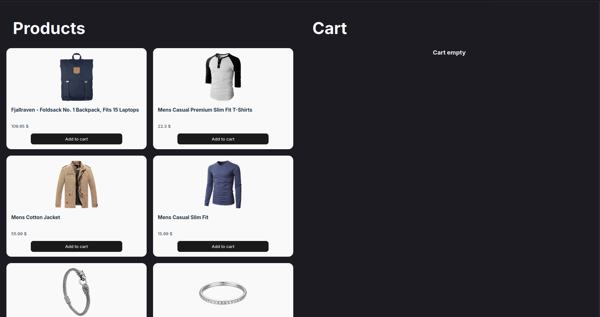
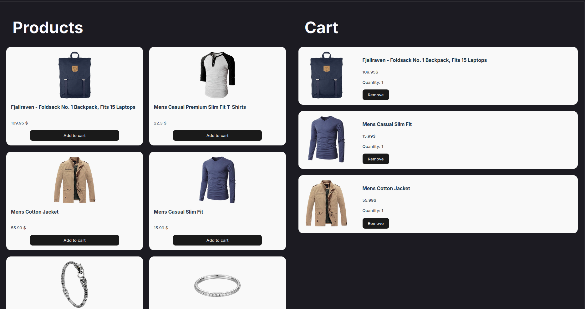
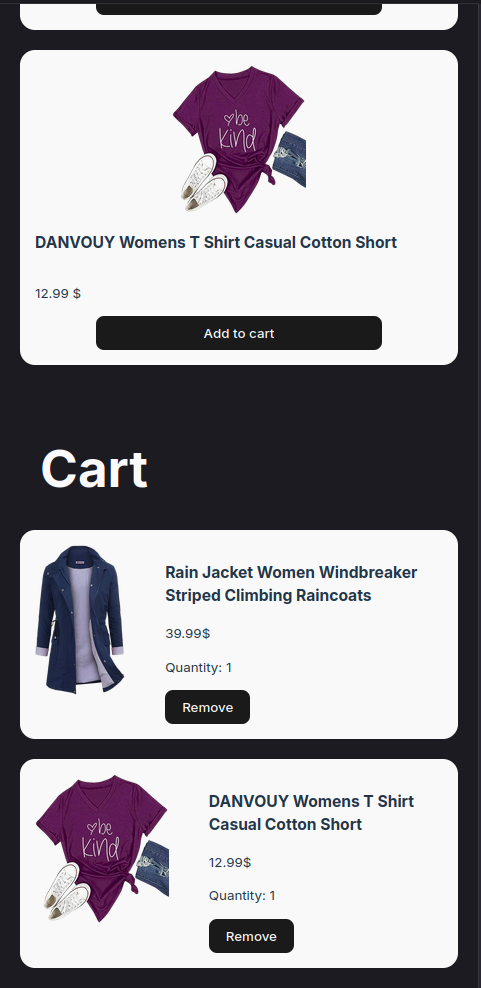

# Mini Market

> Frontend Intern Test Task - Click_Uzb

## F.I.SH:
**Alimboyev Jo'shqin Shuxrat Og'li**

## Vazifa qancha vaqt oldi:
**17 soat**

## Qiyin bo'lgan joylar:
- Grid layout sozlash
- Vanilla JS va React o'rtasida ma'lumot uzatish
- localStorage bilan ishlash

## Texnologiyalar:

<div align="center">


</div>

## Xususiyatlar:

- Mahsulotlarni API'dan yuklash
- Savatga qo'shish/o'chirish
- Umumiy summani hisoblash
- LocalStorage'da saqlash
- Responsive dizayn (Desktop/Mobile)

## Interfeys skrinshotlari:

<details>
<summary> Desktop versiyasi</summary>

### Bo'sh savat:


### To'ldirilgan savat:


</details>

<details>
<summary>📱 Mobile versiyasi</summary>

### Mahsulotlar:


### Savat:


</details>

## O'rnatish va ishga tushirish:

```bash
git clone https://github.com/daik1i-man/mini-marketplace.git

cd mini-market

npm install

npm run dev
```

## Loyiha strukturasi:

```
mini-marketplace/
├── src/
│   ├── products/        # Vanilla JS
│   ├── cart/            # React Components
│   ├── main.jsx
│   └── style.css
├── screenshots/
└── README.md
```

## Demo:
[Live Demo](https://daik1i-man-mini-market.netlify.app)

---

<div align="center">

**Made with ❤️ by [daik1i-man](https://github.com/daik1i-man)**

</div>
